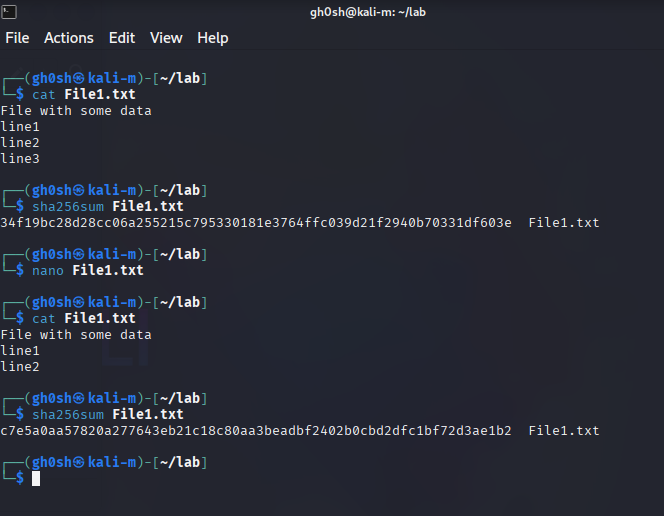

# Task: File Integrity

## Objective
File Integrity check   with `sha256sum`

## *File Used
- `File1.txt` with few lines of data

## *Steps performed

- Check contents of `File1.txt`
- Generate `sha256sum` hash
- Edit the contents of `File1.txt`. In this case removed line3
- Generate latest `sha256sum` hash and compare with previous one

  

## *Observation
`File1.txt` Integrity is compromised as `sha256sum` hash values are different before and after modification.