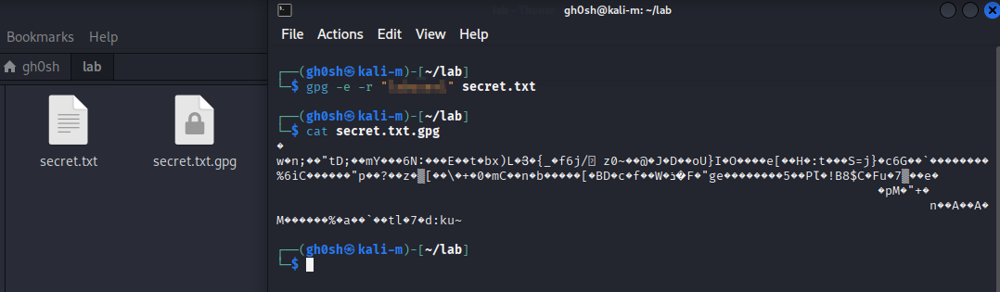
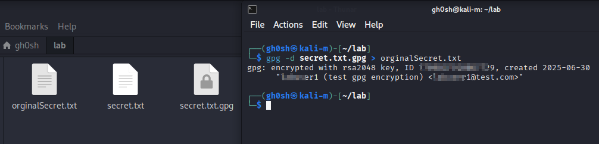

# Task: Encrypt File with **GPG** (GNU Privacy Guard)

## Objective
Demonstrate confidentiality using GPG encryption.

## File Used
- `secret.txt` with set of credentials

## Commands Executed

### Step 1: GPG Installation
```bash
sudo apt update
sudo apt install gnupg -y
```
---

### Step 2: Generate a GPG Key Pair genration

```bash
gpg --full-generate-key
```

Follow the prompts:

- **Key type**: RSA and RSA (option 1)
- **Key size**: 4096 (recommended)
- **Expiration**: 0 days to 1 year
- **Name**: any label
- **Email**: dummy email for testing
- **Passphrase**: (secure passphrase to protect private key)

---

## Step 3: List GPG Keys

```bash
gpg --list-keys
```


---

## Step 4: Encrypt the File "secret.txt"


```bash
gpg -e -r "xxxxxuser" secret.txt
```

Need to enter **GPG key passphrase** when prompted. This creates an encrypted file: `secret.txt.gpg`


---

## Step 5: Decrypt the File and restore orginal content


```bash
gpg -d secret.txt.gpg > originalSecret.txt
```

Need to enter **GPG key passphrase** when prompted.


---
