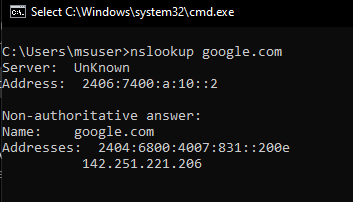
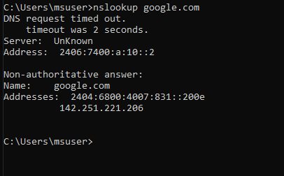
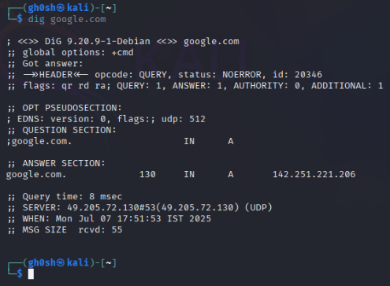

## DNS Test 

DNS resolution functionality from both Windows and Linux systems using valid and invalid DNS configurations.

##  On Windows:

### Test 1: Default DNS Resolution (Working)

### Test 2: Invalid DNS Configuration (Request timeout)

---
##  On Linux:

### Test 1: Default DNS Resolution (Working)

### Test 2: Invalid DNS Configuration

