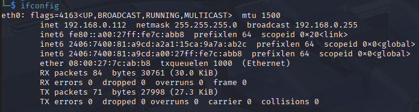

## Initial Network Details

### Linux: 



### Windows:
 
```
   IPv4 Address. . . . . . . . . . . : 192.168.0.113(Preferred)
   Subnet Mask . . . . . . . . . . . : 255.255.255.0
   Lease Obtained. . . . . . . . . . : 07 July 2025 15:22:29
   Lease Expires . . . . . . . . . . : 08 July 2025 15:22:33
   Default Gateway . . . . . . . . . : xxxx::xxxx:xxxx:xxxx:xxxxx
                                       192.168.0.1

```

----